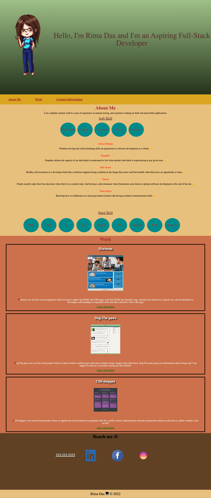

<h1>Assignment2: Creating a Portfolio </h1>

This is my portfolio which exemplifies about me, my softskills, my hardskills, my projects and my Contact information

<h2>Functionality on my webpage</h2>
<ul>
<li>The 1st section is an avatar with my name and what I aspire to become</li> 
<li>The 2nd section is the navigation section, when you will click on the link, it will highlight and will scroll to a section with title</li> 
<li>The 3rd section is about me i.e my current designation, my softskills and my hardskills</li> 

Hover over each of the hardskill titles, you will able to see the percentage of my knowlege about that particular language

<li>The 4th section is about my projects which I did till date during this course</li> 

I have added shadow to the text of the work titles

When you hover over the work image it will enlarge that the actual size

The 1st work is the largest, followed by 2nd work and then 3rd work

When you click on the image, it will navigate you to the website

Below the description, there is a link to git hub, when you hover over the link, the text color changes and when you click on the click it will navigate to github

<li>The 5th section is my contact Details (Note that they are not valid once)</li> 
<li>The 6th and the last section has a footer</li> 
<li>The website is viewable on various screens and devices</li>
</ul>

<h2>Link to the Website</h2>

https://rimadas9878.github.io/Assignment02-About-Me/

<h2>Link to the github</h2>

https://github.com/rimadas9878/Assignment02-About-Me

<h2>Image of the website</h2>
